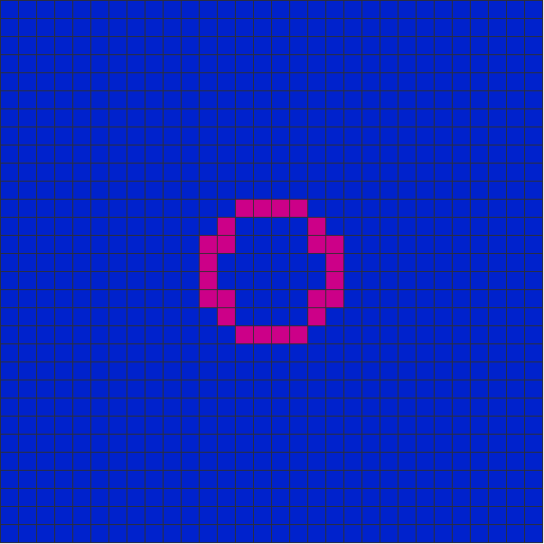

# matrix-life
In this repository, I will be sharing my journey of learning and implementing the concepts of cellular automata and other related topics. 

## Conway's Game of Life
Every journey about cellular automata starts with the most famous one, Conway's Game of Life.

Conway's Game of Life is a cellular automaton devised by the British mathematician John Horton Conway in 1970. It is a zero-player game, meaning that its evolution is determined by its initial state, requiring no further input. One interacts with the Game of Life by creating an initial configuration and observing how it evolves.

The evolution is defined by a small set of rules:
1. Any live cell with fewer than two live neighbours dies, as if by underpopulation.
2. Any live cell with two or three live neighbours lives on to the next generation.
3. Any live cell with more than three live neighbours dies, as if by overpopulation.
4. Any dead cell with exactly three live neighbours becomes a live cell, as if by reproduction.

## Elementary Cellular Automata
Elementary cellular automata are the simplest possible one-dimensional cellular automata. They consist of a line of cells, each of which can be in one of two states, and rules for updating the cells based on the states of their neighbors. The rules are specified by a table that lists all the possible configurations of the neighborhood and the state each configuration leads to in the next time step. As there are $2^3 = 8$ possible configurations for a neighborhood of three cells, there are $2^8 = 256$ rulesets defining elementary cellular automata.

## Floating Game of Life
Floating Game of Life is my custom variant of Conway's Game of Life, where the cells state is not restricted to 0 or 1, but can be any real number in the range [0, 1]. This state of the cell is its "activation" and changes based on the sum of activation of its neighbors. The rules are as follows:
1. Any cell with neighborhood activation sum less than 2.0 reduces its activation by 15%, as if by underpopulation.
2. Any cell with neighborhood activation sum above 3.0 reduces its activation by 15%, as if by overpopulation.
3. Any cell with neighborhood activation sum around 3.0 (+/- 0.15) is fully activated, as if by reproduction.
4. Any other cell remains in its current state.

### Visualizations
The following is a visualization of an interesting base structure that converges after 275 timesteps to four squares (which are stable similar to the regular Conway's Game of Life)

